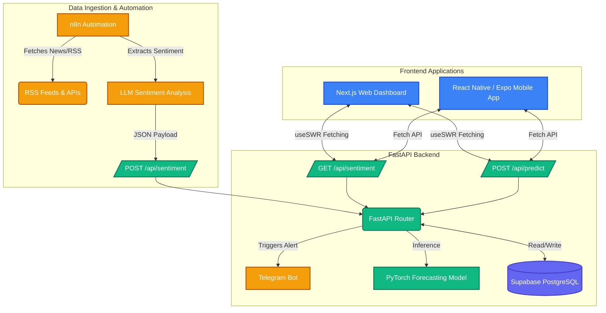

# 📈 QuantVantage AI

**Real-Time Sentiment Analysis & Price Forecasting Engine**

QuantVantage AI is a full-stack, enterprise-grade application that ingests real-time financial news, performs advanced natural language processing to extract market sentiment, and leverages predictive machine learning models to forecast short-term price movements for major assets (AAPL, IONQ, BTC, ETH, SOL).


---

## 🏗️ System Architecture

The application is built on a highly decoupled, scalable microservices architecture. It combines modern web technologies with robust data engineering pipelines and machine learning inference.



---

## 🚀 Key Features

### 1. **Live Sentiment Analysis**
- Ingests hundreds of articles and financial news sources automatically.
- Uses advanced NLP to assign a sentiment score (-1.0 to 1.0) and categorize it as **Bullish**, **Bearish**, or **Neutral**.
- Calculates the 24-hour moving average of market sentiment.

### 2. **AI Price Forecasting (14-Day Horizon)**
- PyTorch-based sequence modeling predicts price movements up to 14 days into the future.
- Uses a fusion of historical price momentum, volume, and the calculated sentiment scores as input features.
- Generates 1-sigma and 2-sigma confidence intervals to visualize potential volatility.

### 3. **Real-time Notifications**
- Asynchronous Telegram alerts notify users immediately when an extreme sentiment shift (e.g., highly bullish or bearish signal) is detected on high volume.

### 4. **Omnichannel Experience**
- **Web Dashboard**: Built with Next.js 15, React, Recharts, and Tailwind CSS. Features a sleek, responsive, glassmorphism dark mode.
- **Mobile App**: Built with React Native & Expo, allowing users to track forecasts and sentiment on the go with pull-to-refresh capabilities.

---

## 🛠️ Technology Stack

| Layer | Technologies Used |
| :--- | :--- |
| **Frontend (Web)** | Next.js, React, Tailwind CSS, Recharts, SWR, Lucide Icons |
| **Frontend (Mobile)**| React Native, Expo, React Navigation |
| **Backend API** | FastAPI, Python, Pydantic, Uvicorn |
| **Machine Learning** | PyTorch, Scikit-learn, Pandas |
| **Database** | Supabase (PostgreSQL), pgvector |
| **Automation** | n8n (Data ingestion workflows) |
| **Hosting** | Vercel (Web), Render (API) |

---

## 📂 Project Structure

```text
quantvantage-ai/
├── apps/
│   ├── web/                # Next.js web application
│   ├── mobile/             # Expo React Native mobile application
│   └── api/                # FastAPI backend & PyTorch inference
│       ├── models/         # Pydantic schemas & PyTorch model definitions
│       ├── routers/        # API endpoints (sentiment, predictions)
│       └── utils/          # Telegram alerts, helpers
├── README.md
└── package.json
```

---

## 💻 Getting Started (Local Development)

### Prerequisites
- Node.js (v18+)
- Python (3.10+)
- Supabase account (or local instance)

### 1. Start the Backend (FastAPI)
```bash
cd apps/api
python -m venv .venv
source .venv/bin/activate  # On Windows: .venv\Scripts\activate
pip install -r requirements.txt
uvicorn main:app --reload --port 8000
```

### 2. Start the Web Dashboard (Next.js)
```bash
cd apps/web
npm install
npm run dev
```

### 3. Start the Mobile App (Expo)
```bash
cd apps/mobile
npm install
npm run start
# Press 'w' to open in web simulator, or 'a'/'i' for Android/iOS
```

---

*Developed for algorithmic traders and institutional quants to gain an unfair advantage in the market.*

